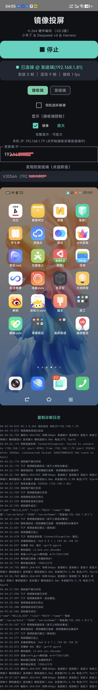
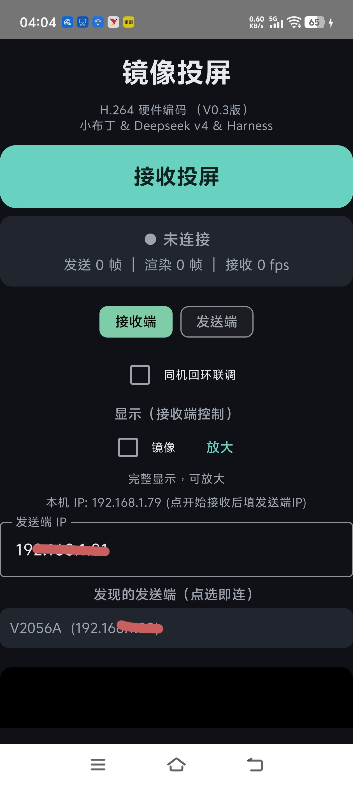

# 镜像投屏 · H.264 双机直连版（MirrorCast H264）

两台安卓手机之间的低延迟实时投屏：发送端 MediaProjection → **H.264 硬件编码** → TCP 直连 → 接收端**硬解渲染**，稳态延迟约 100~200ms。局域网点对点直连，不经过任何服务器，免 root 免 adb。

> English: MirrorCast H264 streams one Android phone's screen to another over LAN using H.264 hardware encoding/decoding over TCP, at ~100–200 ms latency. Peer-to-peer, no server, no root.

## 姊妹版本

本项目与 [mirrorcast-mjpeg](https://github.com/jie-dle/mirrorcast-mjpeg) 是同一需求的两条技术路线，按场景选用：

| | 本项目（H.264 双机直连版） | mirrorcast-mjpeg（MJPEG 浏览器版） |
|---|---|---|
| 观看端 | 另一台安卓手机，装本 APP | 任何浏览器，**零安装** |
| 延迟 | **100~200ms** | 300~500ms |
| 原理 | H.264 硬编硬解 + TCP 双通道 | MJPEG over HTTP |
| 适合 | 双安卓机之间追求流畅低延迟 | 给电脑/随便什么设备看，最省事 |

## 界面预览

| 主界面 · 发送端（分辨率 / 帧率可调） | 主界面 · 接收端（填 IP / 点选自动发现） | 接收端观看（硬解直出） |
|:---:|:---:|:---:|
|  |  |  |

## 软件介绍

单 APK 双角色：同一个安装包，打开后选「发送端」或「接收端」。角色与对端 IP 会持久记忆，**配好一次，之后打开即用**。

本仓库为已冻结的功能终版：核心管线稳定可用，不再加新功能（后续的无障碍反控等能力在内部版本演进，形态不同，不在此仓库范围内）。

## 功能特点

- H.264 硬件编码/解码，两端 CPU 占用都低
- 延迟 100~200ms（浏览器 MJPEG 方案为 300~500ms）
- 双通道架构：视频 TCP **8091** + JSON 控制通道 TCP **8090**（HELLO 握手、指令/回执制）
- 帧协议 `[4字节大端长度][帧数据]`，TCP_NODELAY，应用层丢旧帧保实时
- 镜像/裁切在接收端显示层完成，发送端只管编码推流

## 使用方法（首次）

两台安卓手机连**同一 Wi-Fi**，两边都安装本 APP：

1. **发送端**：打开 APP → 选「发送端」→ 点开始投屏 → 同意「录制屏幕」授权
2. **接收端**：打开 APP → 选「接收端」→ 填发送端手机上显示的 IP 地址 → 连接
3. 开始观看；结束时各自退出即可

之后再打开：角色和 IP 都已记住，直接开始 / 连接即可。

## 构建

- **直接下载 APK**：见本仓库右侧 [Releases](../../releases)（debug 签名，下载后允许「安装未知应用」即可安装）
- **Android Studio**：打开本项目根目录，等 Gradle Sync 完成后 Run
- **命令行**：`gradlew.bat assembleDebug`，产物在 `app/build/outputs/apk/debug/`

环境要求：Android Studio（compileSdk 34，minSdk 26，Gradle 8.13）。

## 技术原理

发送端 MediaProjection → VirtualDisplay 的 Surface **直连** MediaCodec 硬件编码（H.264 Baseline、KEY_LATENCY=1、无 B 帧）→ Annex-B 裸流按 `[4字节大端长度][帧]` 经 TCP_NODELAY 发送 → 接收端 MediaCodec 硬解 → SurfaceView 直出。

设计依据：

- 架构与 scrcpy 同构（采集 → Surface 硬编 → 裸流 → 硬解直出），方向经过验证；
- 浏览器观看 H.264 需走 WebCodecs/MSE，多一层不可控缓冲，故改为双端装 APP 直接硬解；
- 传输选 TCP 而非 UDP：局域网可靠性优先，实时性靠应用层丢旧帧保证。

详细设计文档见 [设计方案-V0.3.md](设计方案-V0.3.md)。

## 许可证

[Apache License 2.0](LICENSE)
